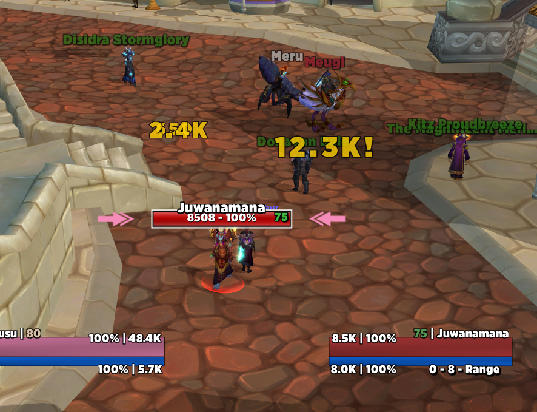

# Lausudo Warmane UI Suite

A privacy-first, reproducible visual setup for the Wrath 3.3.5a client used with Warmane. The repository contains original addons and visual profiles, clearly licensed third-party addons, a cautious PowerShell installer, dependency links, and read-only validators.

The WoW client, HD patch contents, personal configuration, account state, SavedVariables, screenshots, logs, caches, private fonts, shaders, LUTs, and other unapproved media are not part of this project.

Personal disaster recovery and public sharing use separate repositories. The private recovery project preserves the actual client and each character's settings; this public project contains reviewed shareable components. **This public installer is not an exact client backup.** See [Backup and sharing](docs/BACKUP-AND-SHARING.md).

> **Release status:** v2 is a release candidate under development. Existing v1 tags and release assets remain immutable. The repository will be renamed only after clean-client validation, privacy and license review, and visual signoff.



## Included

| Component | Treatment |
| --- | --- |
| LausudoStyle | Original ElvUI companion that creates a separate visual profile and can restore the previous profile |
| Lausudo Visual Core | Small, newly authored WeakAuras visual pack installed only on explicit in-game command |
| Crisp FCT | Original plate-attached combat text addon |
| Warmane Font Pack | Redistribution-cleared LibSharedMedia fonts with original licenses |
| TidyPlates and Threat Plates | Clean copies pinned to the Kader Wrath backport commit, with MIT and GPL notices |

ElvUI, ProjectZidras, and the maintained [WeakAuras WotLK backport](https://github.com/NoM0Re/WeakAuras-WotLK/releases/tag/5.21.11) are link/detect-only. HD patches, ReShade, DXVK, private media, and third-party WeakAuras packs are never enabled or bundled implicitly. See [the component manifest](manifests/suite.json) for the machine-readable distribution policy.

## Safe first run

Close the target client before any mutating action. Audit is the default and does not write:

```powershell
.\tools\Install-LausudoSuite.ps1 -WowPath '<client-folder>'
```

Preview the default UI installation without changing files:

```powershell
.\tools\Install-LausudoSuite.ps1 `
  -WowPath '<client-folder>' `
  -Action Install `
  -Components UI `
  -WhatIf
```

Install explicitly after reviewing the audit and preview:

```powershell
.\tools\Install-LausudoSuite.ps1 `
  -WowPath '<client-folder>' `
  -Action Install `
  -Components UI
```

The installer does not read or write private configuration, client patch contents, logs, or screenshots. It validates build 12340 and x86, refuses to mutate a running target client, stages downloads outside the client, records exact hashes, and restores only receipt-owned files. Full behavior is documented in [Installation](docs/INSTALL.md) and [Privacy model](docs/PRIVACY.md).

## In game

Install the supported upstream ElvUI 6.09 first. Install the pinned WeakAuras WotLK dependency before using Lausudo Visual Core. Then enable `LausudoStyle` and use:

| Command | Result |
| --- | --- |
| `/lausudostyle` | Open the ElvUI plugin installer |
| `/lausudostyle apply safe` | Create/apply a new profile using redistribution-safe media |
| `/lausudostyle apply private` | Use exact private media only when it is already present locally |
| `/lausudostyle restore` | Restore the profile selected before Lausudo Style |
| `/lausudowa install` | Explicitly install/update the reviewed original visual pack |

LausudoStyle never imports bindings, macros, chat, combat history, account mappings, character mappings, or existing private profiles. Supported visual QA targets are 1920×1080 and 2560×1440 at 16:9. Other aspect ratios receive a warning.

## Optional visuals

- HD patches remain external. The validator compares only expected filenames, enabled/disabled state, sizes, and optional hashes. It never downloads, renames, or modifies patch files.
- ReShade is link-only. No binary, shader, LUT, or modified preset is included. The private preset remains gated until redistribution terms are documented.
- DXVK is off by default. Explicit `GraphicsRuntime` installation downloads one pinned official archive and verifies SHA-256 before extracting only the x86 D3D9 runtime.
- Gotham, Melli, ToxiUI media, MartyMods shaders, LUTs, and other private assets are detect-only and are never copied.

These components and private-server use are not represented as approved by Warmane. Users are responsible for reviewing the server rules and upstream terms that apply to them.

## Development and release checks

```powershell
npm ci
npm run validate
Invoke-Pester .\tests
.\tools\Build-Releases.ps1
```

The release builder creates each archive twice with sorted entries and a fixed timestamp, requires identical SHA-256 results, and emits both text and CSV checksums. Release gates are tracked in [Release checklist](docs/RELEASE-CHECKLIST.md).

## Documentation

- [Installation and receipt safety](docs/INSTALL.md)
- [Manual fallback](docs/MANUAL-INSTALL.md)
- [Privacy and threat model](docs/PRIVACY.md)
- [Dependencies, provenance, and licensing](docs/PROVENANCE.md)
- [Private asset detection](docs/PRIVATE-ASSETS.md)
- [HD validator](docs/HD-VALIDATOR.md)
- [ReShade and DXVK boundaries](docs/GRAPHICS.md)
- [Known style gaps](docs/STYLE-GAPS.md)
- [Security policy](SECURITY.md)

## License

Project-owned code is MIT-licensed. Third-party addons, libraries, fonts, and media remain under their own terms; see [third-party notices](THIRD-PARTY-NOTICES.md), [pinned addon provenance](third_party/README.md), and the per-component license records.
